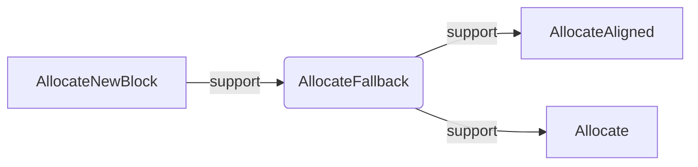

# Arena分析

## 1、功能

统一管理leveldb的内存分配跟释放，简化其它地方的内存管理逻辑。

### 内部逻辑

Arena管理着一个内存块的vector。当需要用户申请一定大小的内存时，会检查当前是否还有剩余空间可以满足申请需求，如果可以，则直接从剩余空间中分配；如果剩余不足以满足申请需求，则判断申请的大小是否大于内部标准大小**kBlockSize**的四分之一，如果大于则直接分配一个申请大小的块，并放入到vector中；如果小于则分配一个标准大小**kBlockSize**的block，并修改剩余空间的指针及剩余大小。

### 优点

对于小块的内存分配可以不需要调用系统函数，提高分配速度。对于较大的块(>1KB)通过直接分配一个新block的方式，以避免空间浪费。

## 2、实现

### 对外接口

```cpp
Arena();
~Arena();
// Return a pointer to a newly allocated memory block of "bytes" bytes.
char* Allocate(size_t bytes);
// Allocate memory with the normal alignment guarantees provided by malloc
char* AllocateAligned(size_t bytes);
// Returns an estimate of the total memory usage of data allocated
// by the arena.
size_t MemoryUsage();
```

### 内部接口

```cpp
char* AllocateFallback(size_t bytes);
char* AllocateNewBlock(size_t block_bytes);
// Allocation state
char* alloc_ptr_;
size_t alloc_bytes_remaining_;
// Array of new[] allocated memory blocks
std::vector<char*> blocks_;
// Total memory usage of the arena.
port::AtomicPointer memory_usage_;
// No copying allowed
Arena(const Arena&);
void operator=(const Arena&);
```

### 调用关系



```cpp
char* Arena::AllocateFallback(size_t bytes) {
  if (bytes > kBlockSize / 4) {
    // Object is more than a quarter of our block size.  Allocate it separately
    // to avoid wasting too much space in leftover bytes.
    char* result = AllocateNewBlock(bytes);
    return result;
  }

  // We waste the remaining space in the current block.
  alloc_ptr_ = AllocateNewBlock(kBlockSize);
  alloc_bytes_remaining_ = kBlockSize;

  char* result = alloc_ptr_;
  alloc_ptr_ += bytes;
  alloc_bytes_remaining_ -= bytes;
  return result;
}
```

AllocateFallback作用是在AllocateAligned、Allocate分配过程中，剩余内存不足时调用；主要功能是根据不同情况分配新block。当申请大小大于**kBlockSize**四分之一时，直接调用AllocateNewBlock并返回结果；否则分配固定大小的block，并将该block赋值给剩余指针。

### 技巧

通过跟自身减一后，做并操作的方式判断是否是2的指数倍。

```cpp
assert((align & (align-1)) == 0);   // Pointer size should be a power of 2
```

取模，如需要对某个数A取5的模，则只需要A&(5-1)即可。

```cpp
size_t current_mod = reinterpret_cast<uintptr_t>(alloc_ptr_) & (align-1);
```

通过assert来确保传入参数符合自己的预期,比如:

```cpp
inline char* Arena::Allocate(size_t bytes) {
  assert(bytes > 0);
```

通过assert来确保计算后的数值符合预期

```cpp
assert((reinterpret_cast<uintptr_t>(result) & (align-1)) == 0);
return result;
```

