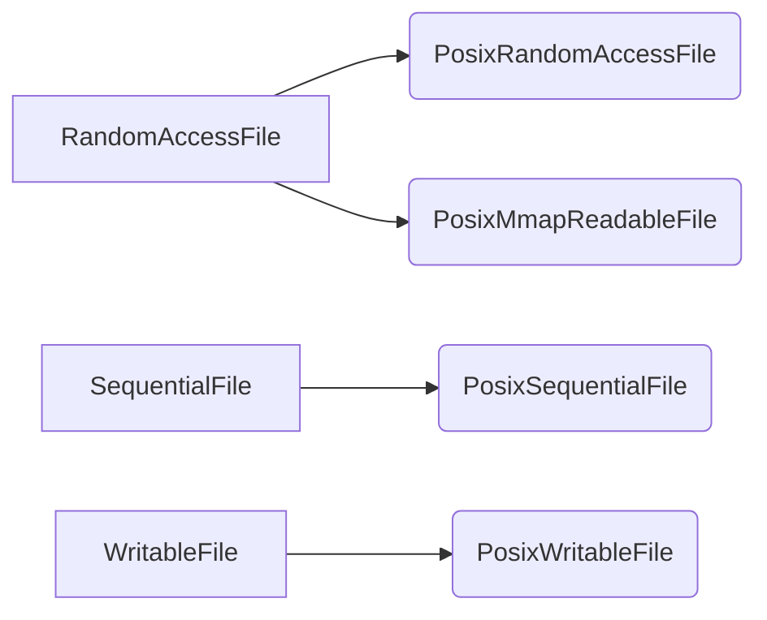

# Env分析

## 功能

env是一个接口，用来访问操作系统的功能，比如文件系统。

## 具体实现

env定义了6个类，其中5个都与文件系统相关。

```cpp
class FileLock;
class Logger;
class RandomAccessFile;
class SequentialFile;
class WritableFile;
class Env;
```

File类在env_posix中实现关系如图



以及定义了3个全局函数，从文件中读取数据，以及写入数据到文件。

```cpp
// Log the specified data to *info_log if info_log is non-NULL.
extern void Log(Logger* info_log, const char* format, ...)
#   if defined(__GNUC__) || defined(__clang__)
    __attribute__((__format__ (__printf__, 2, 3)))
#   endif
    ;
// A utility routine: write "data" to the named file.
extern Status WriteStringToFile(Env* env, const Slice& data,
                                const std::string& fname);
// A utility routine: read contents of named file into *data
extern Status ReadFileToString(Env* env, const std::string& fname,std::string* data);
```

我们先看看三个文件读写类，首先RandomAccessFile，其仅定义了一个Read方法，可以指定读取的偏移及大小。

```cpp
// A file abstraction for randomly reading the contents of a file.
class RandomAccessFile {
 public:
  RandomAccessFile() { }
  virtual ~RandomAccessFile();
  // Read up to "n" bytes from the file starting at "offset".
  // "scratch[0..n-1]" may be written by this routine.  Sets "*result"
  // to the data that was read (including if fewer than "n" bytes were
  // successfully read).  May set "*result" to point at data in
  // "scratch[0..n-1]", so "scratch[0..n-1]" must be live when
  // "*result" is used.  If an error was encountered, returns a non-OK
  // status.
  //
  // Safe for concurrent use by multiple threads.
  virtual Status Read(uint64_t offset, size_t n, Slice* result,
                      char* scratch) const = 0;
 private:
  // No copying allowed
  RandomAccessFile(const RandomAccessFile&);
  void operator=(const RandomAccessFile&);
};
```

env_posix.cc中以PosixRandomAccessFile类实现。其使用全局Limiter来限制打开文件的个数，如果已经超过限制数，则一开始就close fd，然后再在每个操作时打开，接着关闭。

```cpp
// pread() based random-access
class PosixRandomAccessFile: public RandomAccessFile {
 private:
  std::string filename_;//即传fd又传name，是为了满足limiter限制，能够在每次读取时打开、关闭。
  bool temporary_fd_;  // If true, fd_ is -1 and we open on every read.
  int fd_;
  Limiter* limiter_;
 public:
  PosixRandomAccessFile(const std::string& fname, int fd, Limiter* limiter)
      : filename_(fname), fd_(fd), limiter_(limiter) {
    temporary_fd_ = !limiter->Acquire();
    if (temporary_fd_) {
      // Open file on every access.
      close(fd_);
      fd_ = -1;
    }
  }
  virtual ~PosixRandomAccessFile() {
    if (!temporary_fd_) {
      close(fd_);
      limiter_->Release();
    }
  }
  // 为什么要传入Slice* result,char* scratch 两个参数呢，原因是由于返回值status只能返回成功与否，不能返回长度，而单单只有slice也只能设置长度，不能修改指针所指向的值，也就只能slice跟原始数据配合，一个传递数据，slice传递长度。
  virtual Status Read(uint64_t offset, size_t n, Slice* result,
                      char* scratch) const {
    int fd = fd_;
    if (temporary_fd_) {
      fd = open(filename_.c_str(), O_RDONLY);
      if (fd < 0) {
        return IOError(filename_, errno);
      }
    }
    Status s;
    //使用pread而非read，可以避免使用seek，从而不会再多线程中产生race condition
    ssize_t r = pread(fd, scratch, n, static_cast<off_t>(offset));
    *result = Slice(scratch, (r < 0) ? 0 : r);
    if (r < 0) {
      // An error: return a non-ok status
      s = IOError(filename_, errno);
    }
    if (temporary_fd_) {
      // Close the temporary file descriptor opened earlier.
      close(fd);
    }
    return s;
  }
};
```

env_posix还以另一种方式实现了随机读：PosixMmapReadableFile。limiter在这里仅为了释放，调用时获取，由于mmap会占用内存，已经mmap多了也不好，需要limiter限制。文件名没有啥意义，只有在报错时，提示用。

```cpp
// mmap() based random-access
class PosixMmapReadableFile: public RandomAccessFile {
 private:
  std::string filename_;
  void* mmapped_region_;
  size_t length_;
  Limiter* limiter_;
 public:
  // base[0,length-1] contains the mmapped contents of the file.
  PosixMmapReadableFile(const std::string& fname, void* base, size_t length,
                        Limiter* limiter)
      : filename_(fname), mmapped_region_(base), length_(length),
        limiter_(limiter) {
  }
  virtual ~PosixMmapReadableFile() {
    munmap(mmapped_region_, length_);
    limiter_->Release();//在mmap的时候acquire过了。
  }
  virtual Status Read(uint64_t offset, size_t n, Slice* result,
                      char* scratch) const {
    Status s;
    if (offset + n > length_) {
      *result = Slice();
      s = IOError(filename_, EINVAL);
    } else {
      *result = Slice(reinterpret_cast<char*>(mmapped_region_) + offset, n);
    }
    return s;
  }
};
```

下面分析下SequentialFile，读取指定大小的数据，可以指定开始位置，但相对于RandomAccessFile其需要调用额外的Skip方法

```cpp
// A file abstraction for reading sequentially through a file
class SequentialFile {
 public:
  SequentialFile() { }
  virtual ~SequentialFile();
  virtual Status Read(size_t n, Slice* result, char* scratch) = 0;
  // Skip "n" bytes from the file. This is guaranteed to be no
  // slower that reading the same data, but may be faster.
  //
  // If end of file is reached, skipping will stop at the end of the
  // file, and Skip will return OK.
  //
  // REQUIRES: External synchronization
  virtual Status Skip(uint64_t n) = 0;
 private:
  // No copying allowed
  SequentialFile(const SequentialFile&);
  void operator=(const SequentialFile&);
};
```

env_posix.cc具体实现PosixSequentialFile，这里没有使用limiter的原因应该是其只使用到log等顺序读地方，其同时打开的数量不会太多。使用的是fread,fseek，将其的返回值封装成了status。

```cpp
class PosixSequentialFile: public SequentialFile {
 private:
  std::string filename_;
  FILE* file_;
 public:
  PosixSequentialFile(const std::string& fname, FILE* f)
      : filename_(fname), file_(f) { }
  virtual ~PosixSequentialFile() { fclose(file_); }
  virtual Status Read(size_t n, Slice* result, char* scratch) {
    Status s;
    size_t r = fread_unlocked(scratch, 1, n, file_);
    *result = Slice(scratch, r);
    if (r < n) {
      if (feof(file_)) {
        // We leave status as ok if we hit the end of the file
      } else {
        // A partial read with an error: return a non-ok status
        s = IOError(filename_, errno);
      }
    }
    return s;
  }
  virtual Status Skip(uint64_t n) {
    if (fseek(file_, n, SEEK_CUR)) {
      return IOError(filename_, errno);
    }
    return Status::OK();
  }
};
```

继续看顺序写WritableFile，主要定义了4个方法，Flush和Sync的区别是什么？

```cpp
// A file abstraction for sequential writing.  The implementation
// must provide buffering since callers may append small fragments
// at a time to the file.
class WritableFile {
 public:
  WritableFile() { }
  virtual ~WritableFile();
  virtual Status Append(const Slice& data) = 0;
  virtual Status Close() = 0;
  virtual Status Flush() = 0;
  virtual Status Sync() = 0;
 private:
  // No copying allowed
  WritableFile(const WritableFile&);
  void operator=(const WritableFile&);
};
```

env_posix.cc具体实现PosixWritableFile。

```cpp
class PosixWritableFile : public WritableFile {
 private:
  std::string filename_;
  FILE* file_;
 public:
  PosixWritableFile(const std::string& fname, FILE* f)
      : filename_(fname), file_(f) { }
  ~PosixWritableFile() {
    if (file_ != NULL) {
      // Ignoring any potential errors
      fclose(file_);
    }
  }
  //通过fwrite写入数据，封装了下返回值。
  virtual Status Append(const Slice& data) {
    size_t r = fwrite_unlocked(data.data(), 1, data.size(), file_);
    if (r != data.size()) {
      return IOError(filename_, errno);
    }
    return Status::OK();
  }
  virtual Status Close() {
    Status result;
    if (fclose(file_) != 0) {
      result = IOError(filename_, errno);
    }
    file_ = NULL;
    return result;
  }
  //通过fflush将用户态的缓存刷到系统态，但还没有到磁盘。
  virtual Status Flush() {
    if (fflush_unlocked(file_) != 0) {
      return IOError(filename_, errno);
    }
    return Status::OK();
  }
  //如果文件名所在目录有Manifest，则将该目录fsync
  Status SyncDirIfManifest() {
    const char* f = filename_.c_str();
    const char* sep = strrchr(f, '/');
    Slice basename;
    std::string dir;
    if (sep == NULL) {
      dir = ".";
      basename = f;
    } else {
      dir = std::string(f, sep - f);
      basename = sep + 1;
    }
    Status s;
    //使用slice的包含方法
    if (basename.starts_with("MANIFEST")) {
      int fd = open(dir.c_str(), O_RDONLY);
      if (fd < 0) {
        s = IOError(dir, errno);
      } else {
        if (fsync(fd) < 0) {
          s = IOError(dir, errno);
        }
        close(fd);
      }
    }
    return s;
  }
  //如果本目录里有Manifest，则先将该目录sync到磁盘，然后再fflush以及sync到磁盘。
  virtual Status Sync() {
    // Ensure new files referred to by the manifest are in the filesystem.
    Status s = SyncDirIfManifest();
    if (!s.ok()) {
      return s;
    }
    if (fflush_unlocked(file_) != 0 ||
        fdatasync(fileno(file_)) != 0) {
      s = Status::IOError(filename_, strerror(errno));
    }
    return s;
  }
};
```


## 技巧

1. 通过在Options的构造函数中env默认赋值Env::Default()。而Default则是在util/env_posix.cc中实现，通过pthread_once使全局变量default_env仅初始化一次。

   ```cpp
   static pthread_once_t once = PTHREAD_ONCE_INIT;
   static Env* default_env;
   static void InitDefaultEnv() { default_env = new PosixEnv; }
   Env* Env::Default() {
     pthread_once(&once, InitDefaultEnv);
     return default_env;
   }
   ```

2. 通过在使用外部统一的一个limiter，可以全局控制资源的使用。

3. 字符串截取，首先获取后一部分，再通过后一部分减去初始字符串指针，从而得到前一部分的长度，进而生成前一部分字符串

   ```cpp
   const char* sep = strrchr(f, '/');
   dir = std::string(f, sep - f);
   ```

   ​